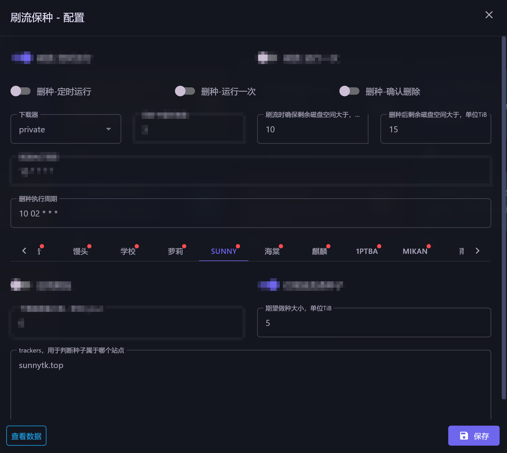
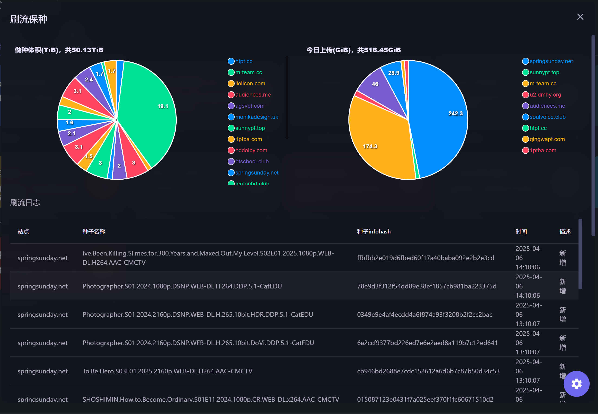

# MoviePilot-Plugins
MoviePilot官方插件市场：https://github.com/jxxghp/MoviePilot-Plugins

## 刷流保种（Brush4Seed）

> 用过其他几个刷流工具，都不太符合我的需求，所以自己试着开发一个

### 我的需求（需求不一样的就不用往下看了）：
> 仅支持qBittorrent
- 种子的筛选不要太复杂
- 尽可能保证始终有种子在下载
- 种子免费到期前及时停止下载
- 种子被站点删除后，及时删除对应做种
- 尽可能保种，删种只在磁盘空间不够时进行

我不想去配置什么是要免费还是要2x免费，做种人数的范围之类的；有免费种子&没下载过=去下载；无非是哪个种子先下载哪个种子后下载的问题。

某个大包免费结束了，还有几百GB没下载完呢，就别给我下载了，睡觉起来一看数据天塌了。

另外删种本来是刷流时判断空间不够用了，需要多少就删除多少的，不过后来发现我用的zfs（主要是打了快照），即使删掉了，可用空间也不会增多，于是改成了不定期运行。

#### 给哪些站点刷流规则(见函数：_get_torrents_for_brush)
- 如果存在未达到保种体积的站点，则仅对这些站点进行刷流，其他已经达到保种体积的站点不会进行刷流(优先新站点)
- 与预期保种体积相差越多权重越高
- 都达到保种体积后，各站点权重相同（目前是这样）

#### 选种规则(见函数:sort_key_for_brush)
- 2xfree比free优先
- 下载人数多，做种人数少的优先
- ~~新发布的种子优先~~(无法获取)
- ~~新开始免费的种子优先~~(无法获取)

#### 删种规则(见函数：DeleteService._get_score_sum)
- `在下载目录中，但是没有被做种的会被删除`
- 种子越小越容易被删除
- 做种人数越多越容易被删除
- 同时被多个站点做种，得分是各个站点之和，更不容易被删除
- 未知站点的做种不得分
- 有`no_delete`tag的种子不会被删除，同时做种多个站点的，其中一个种子有就行，全都不会删除
- 如果某个种子被删除后会导致对应站点达不到期望的做种体积了，则不会删除该种子

### 刷流
刷流配置，删种部分的已打码

- `刷流-定时运行`：打开时，按照`刷流执行周期`定时运行
- `刷流-运行一次`: 打开并保存，会立即运行一次
- `下载器`: 刷流、各站点保种体积的计算等操作，仅涉及这里选择的下载器；仅支持qBittorrent
- `同时下载数`：和qb中设置同时下载数的不同，这个是用来计算需要往下载器中新增几个种子的
- `刷流时确保剩余空间大于，单位TiB`：剩余空间小于这个值时，不会新增下载种子
- `刷流执行周期`: cron表达式，支持配置多个，用`|`隔开
- `启用刷流`：不启用的不会进行刷流
- `仅刷流免费种子`：vip大佬可能会需要取消勾选
- `下载速度最小值`：平均下载速度小于这个的，会被暂停（未测试）
- `期望做种大小`：判断给哪些站点刷流的重要条件，即使不启用该站点的刷流，也推荐设置，删种时会用到
- `trackers`: 判断某个种子属于哪个站点的重要条件，目前仅部分站点有内置的（作者没那么多站），没有内置的务必手动填入，几乎影响所有的流程

### 删种
删种配置，刷流部分的已打码

- `删种-定时运行`：配合`删种执行周期`使用
- `删种-运行一次`：打开并保存，会执行一次
- `删种-删除确认`：不打开时，只记录候选删种列表（可在刷流日志下面查看），打开时才会真正删除
- `刷流时确保剩余空间大于，单位TiB`：剩余空间小于这个值时，才会触发删种
- `删种后剩余空间大于，单位TiB`：用于计算需要删除多少种子，例如当前可用磁盘为9TiB，配置这个值为15TiB，则会删除15-9=6TiB的种子
- `删种执行周期`：cron表达式

### 数据统计

- `做种体积`：根据tracker判断种子属于哪个站点，然后累加得来；选择了`下载器`后，并运行过一次刷流才会显示
- `今日上传`：实时统计；每日0点会给`下载器`中的所有种子打一个快照，当前种子的上传量减去当日零点时的上传量就是这个种子今天的上传

### 该插件涉及到的tag和categories

某个种子根据tracker判断出属于哪个站点后，会被添加`site:xxx`的tag
刷流新增的种子会被添加`brush4seed`的categories
有`no_delete`tag的种子不会被自动删除
